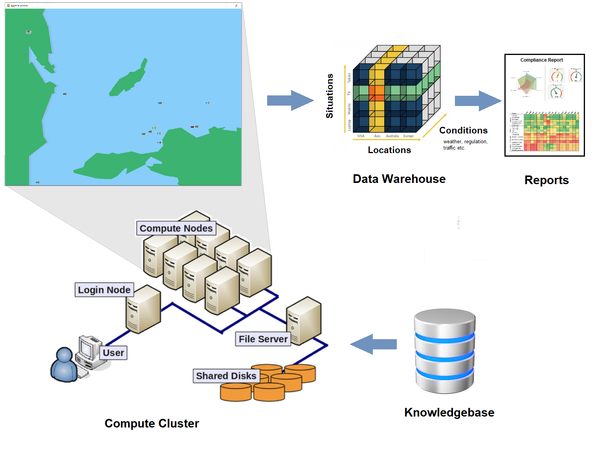

# COS (Co-Simulation Operating System) - Core packages

 

- **Github repository**: <https://github.com/sreekants/cospy>

## COSPy (cospy): core packages for the Co-Simulation Operating System (COS)

This repository contains the **core Python packages** for **COS — the Co-Simulation Operating System**, a platform aimed at running *very large numbers* of high-fidelity simulations to test autonomous systems via digital twins. COS is a **“testable metaverse”**: a controlled virtual world where autonomous software can be dropped into realistic scenarios, exercised at scale, and assessed with repeatable, data-driven evaluation.

### What COS is trying to solve

Testing autonomy (especially in safety-critical domains) is hard because the “interesting” edge cases are rare, expensive, and ethically difficult to reproduce in the real world. COS approaches this by treating testing as a *massively parallel simulation problem*. It introduces the concept of **“simulules”**—containerized simulation capsules designed to run on a workstation *or* on an HPC cluster. Each simulule represents one permutation of a scenario (e.g., environment + traffic + sensor noise + initial conditions), with the target autonomy stack inserted as a **digital twin**. ([GitHub][1])

At scale, COS aims to orchestrate 100,000 to 10 million scenarios in parallel, store results in a database, and support downstream analysis/visualization through a performance dashboard workflow. While the motivating use case is **autonomous vessels**, the repo positions COS as **domain-agnostic** (maritime, road, rail, aerial). ([GitHub][1])

### Architectural ideas (microkernel + plug-in “faculties”)

COS is an “embedded operating system” for distributed simulation, built around a **microkernel-style** architecture and extensibility via plug-ins called **“faculties.”** Faculties are intended to encapsulate capabilities—such as models of propulsion, telecommunications, sonar, visual detection, etc.—so fidelity can be increased without turning the platform into a monolith. 

Two explicit inspirations are:

* **[Inferno Operating System](https://en.wikipedia.org/wiki/Inferno_(operating_system))**, notably the idea of exposing resources uniformly (the README emphasizes sockets rather than files) and organizing them in a hierarchical namespace that can span local and remote resources.
* **[ROS (Robot Operating System)](https://en.wikipedia.org/wiki/Robot_Operating_System#Services)**, particularly the node/service/topic communication paradigm. COS adopts a message-oriented approach where capabilities are modular software nodes that advertise services and communicate over a topic-like backbone.

### What’s in this repository

From the top-level layout, this repo looks like the “core runtime + tooling” layer that other COS deployments build on. It includes directories such as:

* `src/` (core implementation),
* `apps/` (application entry points),
* `templates/cluster/` (cluster/HPC-oriented templates),
* `samples/simulation/` (example simulations),
* `config/` (scenario/configuration material),
* `idl/` (interface definitions),
* `tools/` and `tests/`,
* plus `docs/` and a “[Getting Started Guide](docs/GettingStarted.md)” linked from the README. 

### Research context (why it exists)

Although generally applicable, COS is originally movivated as a safety assurance and compliance testing environment for maritime autonomy—especially around **COLREG** (collision regulations). The linked paper *“[Safety Assurances of Autonomous Vessels](https://www.researchgate.net/publication/385274872_Safety_Assurances_in_Autonomous_Vessels)”* describes a virtual testing environment built on digital twins plus a test-management approach for generating and assessing navigational scenarios. 
Later work, *[Legata - a domain language for regulatory compliance](https://www.researchgate.net/publication/386174675_Legata_-A_domain_language_for_regulatory_compliance)* demonstrates COS applications designed to integrate regulatory logic into scenario generation and evaluation pipelines. 

To simmarize, `cospy` is best understood as the foundational software layer for COS—a microkernel-inspired, ROS-like, plug-in extensible co-simulation “operating system” focused on scaling autonomy validation from “a few hand-built scenarios” to “millions of systematically varied test cases,” with strong ties to maritime safety assurance research. 

## Quick Links
  * [Getting Started Guide](docs/GettingStarted.md)

Copyright 2023, Norwegian University of Science and Technology.
