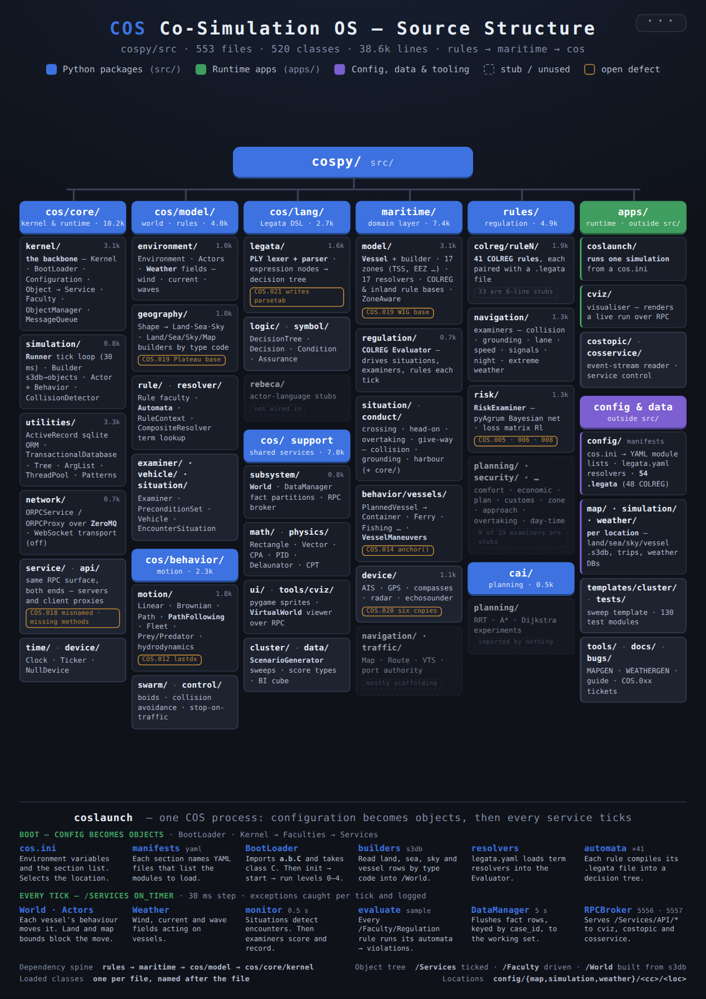

# COS architecture

This document describes the physical structure of `src/` (where each class lives) and the logical
structure (how the classes cooperate at boot and on every tick). It reflects the tree on
2026-09-24: 553 Python files, 520 classes, about 38,600 lines. Appendix A lists every class with its
file and base classes. For building locations (land, sea and vessel databases), see
[`MAPGEN.md`](../tools/mapping/MAPGEN.md). For a functional walk-through of one run, see the
[guide](guide/GUIDE.md).

<p align="center"><a href="guide/cos-structure.html"></a></p>

*Figure 1. The source tree on one page: packages by size, open defects (amber), stubs (dashed), and
what one `coslaunch` process runs at boot and on every tick. The printable A4 version is
[`guide/cos-structure.html`](guide/cos-structure.html). Sections 1 and 2 below explain each part.*

---

## 1. Physical structure

`src/` holds four top-level packages. The dependencies run one way: `rules` → `maritime` → `cos`.

```
src/
├── cos/        294 files, 25.8k lines  ─ generic simulation OS (domain-neutral)
├── maritime/   135 files,  7.4k lines  ─ maritime domain model built on cos
├── rules/      115 files,  4.9k lines  ─ regulation content: COLREG rules + examiners
└── cai/          8 files,  0.5k lines  ─ path-planning experiments; nothing in cos, maritime or rules imports it
```

### 1.1 `cos/` — the simulation operating system

| Package | Classes | Contents |
|---|---|---|
| `core/kernel` | 36 | `Kernel`, `BootLoader`, `Configuration`; the object hierarchy `Object` → `Service` / `Faculty` / `Subsystem` / `CompositeService`; `ObjectManager` (the namespace tree); `MessageQueue` / `IPCMessage` (topic pub/sub); `Logger`; `Device` / `DeviceManager`; `FileSystem` / `BootImage`; thread pool |
| `core/simulation` | 13 | `Simulation` (the kernel singleton), `Runner` / `RunnerThread` / `SimulationClock` (the tick loop), `Builder` (s3db → objects), `Actor` + `Behavior`, `CollisionDetector` |
| `core/network` | 8 | `ORPCService` / `ORPCProxy`, ZMQ and WebSocket transports |
| `core/service` / `core/api` | 14 / 12 | the remote API from both ends: servers (`ORPCService`) and client proxies (`ORPCProxy`) for MQ, ObjectManager, Timer, Topic, World, Vessel, … |
| `core/utilities` | 34 | `ActiveRecord` (sqlite ORM), `TransactionalDatabase`, `Tree` / `TreeNode`, `ArgList`, `ThreadPool`, `Patterns`, `GraphDatabase`, `InvertedIndex` |
| `core/time`, `core/device` | 2, 2 | `Clock`, `Ticker`; `NullDevice` |
| `subsystem/{world,data,network}` | 10 | `World` (a composite of environment services), `DataManager` + `Partition` (fact tables), `RPCBroker` / `WebSocketBroker` |
| `model/environment` | 16 | `Environment`, `Actors`, `Weather` / `WeatherSystem` (wind, sea current, waves), `Scales` |
| `model/geography` | 29 | `Shape` → `Land` / `Sea` / `Sky` subclasses; `LandBuilder` / `SeaBuilder` / `SkyBuilder` / `MapBuilder` |
| `model/rule` | 7 | `Rule` (a Faculty), `Automata` (compiled Legata), `Context` (the rule context), `Situation`, `RuleSet`, `ScoreCard` |
| `model/examiner` | 4 | `Examiner`, `ConcernExaminer`, `Precondition` / `PreconditionSet` |
| `model/resolver` | 9 | `Resolver`, `CompositeResolver`, mapping / range / list resolvers — the term-resolution framework |
| `model/situation`, `model/vehicle` | 2, 5 | `EncounterSituation`; `Vehicle`, `ValueSet`, `Intent` |
| `behavior/{motion,control,swarm}` | 26 | `MotionBehavior` → Linear / Brownian / Path / PathFollowing / Fleet / Prey / Predator; hydrodynamic models; boids |
| `lang/{legata,logic,rebeca,symbol}` | 37 | the Legata DSL: PLY `Lexer` / `Parser` and expression nodes; `DecisionTree` / `Decision`; Rebeca actor stubs |
| `math/*`, `physics/force` | 25, 2 | geometry (`Rectangle`, `Vector`, `CPA`, `Distance`), functional (`PID`, `Polynomial`), `Delaunator`, `CPT` |
| `data/{bi,score}` | 12 | score types (Binary, Cumulative, Sample, …) and the BI cube builder |
| `cluster/runtime` | 3 | `ScenarioGenerator`, `TemplateReplicator` |
| `ui/{game,gui}`, `tools/cviz` | 22, 8 | pygame sprites; the `cviz` visualiser (`VirtualWorld`, which talks to the simulation over RPC) |

### 1.2 `maritime/` — the domain layer

| Package | Contents |
|---|---|
| `model/vessel` | `Vessel` (extends `Vehicle`) with the `Type` / `Operation` / `Status` / `Restriction` flags; five subtypes; `Builder`; `VesselComposer` |
| `model/geography` | 17 legal and traffic zones (EEZ, TSS, lanes, …) that extend `cos` `Sea`; `SeaBuilder`, which registers the type codes |
| `model/resolver` | 17 maritime resolvers: OwnShip, TargetShip, Target, Fleet, Sea, Land, Zone, TSS, EEZ, … |
| `model/rule`, `model/zone` | `COLREG` and `InlandWaterRule` (extend `Rule`); the `ZoneAware` mixin, `ZoneRules`, `SpatialZones` |
| `core/situation` | `MaritimeSituation` → `MaritimeEncounterSituation` / `MaritimeConductSituation`; `Maneuver` |
| `situation/*`, `conduct/*` | situation faculties: crossing, head-on, give-way, overtaking, stand-on, traffic; collision, grounding, harbour, channel, obstruction |
| `regulation/colreg` | `Evaluator` (the per-tick driver), its `Resolver` and `API` |
| `regulation/{inland,internal}` | zone rule classes (harbour, inshore, lane, TSS, waterway) |
| `behavior/vessels` | `PlannedVesselBehavior` and its subclasses (Container, Ferry, Fishing, …); `VesselManeuvers` (COLREG manoeuvre operations) |
| `device/communication`, `navigation`, `traffic` | AIS, GPS, compasses, radar, echosounder; `Map`; VTS, port authority, zone allocation |

### 1.3 `rules/` — regulation content

- `colreg/ruleN/RuleN.py`: 41 classes, one per COLREG rule. Each is a thin `COLREG` subclass paired
  with `config/maritime/regulation/colreg/RuleN.legata`. Only rules 3, 9, 10, 13, 15, 17, 19 and 34
  add behaviour; the rest are 6-line stubs whose logic, where it exists, is in the Legata file.
- `examiner/*`: 19 concrete examiners, plus the `NavigationExaminer` base and risk helper classes,
  grouped by concern: navigation (collision, grounding, lane discipline, speed, signals, night-time,
  extreme weather), risk (`RiskExaminer` with a pyAgrum Bayesian network), environmental, planning
  and security. **9 of the 19 are stubs:** seven copies of one empty 24-line template (`Approach`,
  `Overtaking`, `Comfort`, `Plan`, `Economic`, `Customs`, `ZoneViolation`), plus `DayTimeExaminer`
  and `TestInspector`.

### 1.4 Outside `src/`

- `apps/`: launchers that compose `src/`. They are `coslaunch` (the simulation), `cviz` (the
  visualiser), `costopic` and `cosservice` (command-line RPC clients).
- `config/`: `cos.ini`, the YAML manifests, Legata rule files, and location data (§2.2 and `MAPGEN.md`).
- `tests/` mirrors `src/` for the packages it covers.

---

## 2. Logical structure

### 2.1 Everything is an `Object` in one namespace tree

`Object` gives every class an identity (type, id, guid) and a message topic. Its specialisations
decide where an instance sits in the tree:

```
Object ─┬─ Service    → /Services/<type>/<name>        ticked every step by the Runner
        │    ├─ Subsystem          kernel level: World, DataManager, brokers
        │    ├─ CompositeService   World = Environment + Actors + Weather …
        │    └─ ORPCService        /Services/API/*, remotely callable
        ├─ Faculty    → /Faculty/<category>/<type>/<name>   not ticked; driven by a Service
        │    ├─ Rule → COLREG / InlandWaterRule → rules.colreg.RuleN
        │    ├─ Examiner → ConcernExaminer → rules.examiner.*
        │    └─ Situation → EncounterSituation → MaritimeSituation → situation/*, conduct/*
        └─ world objects → /World/{Land,Sea,Sky,Vehicle/Vessel,Weather/*}   built from s3db
```

`ObjectManager` stores this tree. Components find each other by path, not by import. For example,
`Evaluator` calls `get_all("/Faculty/Regulation")` and `World` builds its collider from `/World/Land`.
**These paths are the real interfaces between packages.** Renaming a category or type is a breaking
change, even when no import changes.

### 2.2 Boot: configuration becomes objects

```
cos.ini [Simulation]
    Kernel=Subsystem  Faculties=Environment,Monitors,Signals,Actors,Rules  Services=NetworkServices
  → each name is an .ini section → each key names a YAML manifest → packages.modules[] → a class
BootLoader.load_class("a.b.C")  imports module a.b.C and takes attribute C
                                (the class name must equal the file name)
  → inst = C(args) ; inst.on_init(ctxt, module)
  → start: on_start for all, then on_run at run levels 0–4 ; stop mirrors this (on_term, on_stop)
```

- `$(CONFIG)`, `$(MAP)`, `$(SIMULATION)`, `$(TRAFFIC)` and so on come from `cos.ini`
  `[EnvironmentVariables]` and are expanded in manifest `args`, `config` and `database` fields.
- Builders are Services whose `on_init` reads rows from a location's s3db by type code and registers
  each row as a `/World/...` object (see `MAPGEN.md` §3–§5).
- The language resolvers are a second registry, `config/legata.yaml`, which `Evaluator` loads into
  its `CompositeResolver`.

### 2.3 Runtime: one tick

```
RunnerThread (sleeps 30 ms per tick) → traverse /Services → on_timer()
  ├─ World / Actors.on_timer        → each Vehicle → Actor.update → Behavior.move
  │                                   → CollisionDetector (land polygons + map bounds)
  ├─ Environment / Weather          → force fields (wind, current, waves)
  ├─ COLREG.Evaluator.on_timer
  │    ├─ every 0.5 s  monitor(): build a RuleContext(resolver, world, vessels, API)
  │    │     /Faculty/Situation/Incident   → preprocessors
  │    │     /Faculty/Situation/Maritime   → detect encounters; post them to the rules
  │    │                                     (IPC /Faculty/Regulation/Rules)
  │    │     /Faculty/Situation/Processors → examiners score and record
  │    └─ every sample.frequency  evaluate(): each /Faculty/Regulation rule
  │                                → Automata (compiled .legata) → violations
  ├─ DataManager                    → flushes queued fact rows (with case_id) to the working set
  └─ RPCBroker                      → serves /Services/API/* to cviz, costopic, cosservice
```

Exceptions inside a Service's `on_timer` are caught per tick and logged by the Runner. A failing
service therefore degrades quietly instead of stopping the run, so check the log after every run.

### 2.4 How a rule reads the world

A Legata clause refers to terms such as `(OwnShip,TargetShip).DCPA`. The `RuleContext` resolves them
through `CompositeResolver`, which dispatches by prefix and property name to a resolver listed in
`config/legata.yaml`. Each resolver reads the current `rule_ctxt.situation` (own ship, target ship,
fleet, zone) that a rule or situation faculty has set. That shared situation couples rules and
examiners; see bugs COS.007 and COS.008.

### 2.5 Layering

| Layer | Responsibility | Must not depend on |
|---|---|---|
| `cos` | kernel, objects, ticks, messages, persistence, the rule language, a generic world of shapes and vehicles | `maritime`, `rules` |
| `maritime` | the meaning: vessels, zones, encounters, manoeuvres, the COLREG evaluator | `rules` |
| `rules` | regulation as data (Legata) plus thin classes and examiners | — |

### 2.6 Naming conventions

- **One class per file, named after the file**, for anything a manifest loads. The loader enforces
  this, and `ORPCProxy` derives its remote target (`/Services/API/<ClassName>`) from the class name.
  Library modules that export several helpers (`Patterns`, `RiskModel`, `legata/Expression`) are
  exempt, because nothing loads them by name.
- **Mirrored names are intentional.** `World`, `Sea`, `Vessel`, `Topic`, `MQ`, `Timer`, `Port` and
  `Radar` each exist as a client proxy (`core/api`), a remote service (`core/service`) and, where it
  applies, a model class. Import them with an alias (`World as WorldService`).
- **Accidental collisions to avoid:** two `Situation` classes (the data holder in `cos.model.rule`;
  the Faculty in `cos.model.situation`), two `WeatherSystem` classes (model vs `ui.game` sprite),
  three `Actor` classes, and two `SailingVessel` classes (behaviour vs model). Existing code aliases
  them (`Context as RuleContext`); new classes should get distinct names.

---

## 3. Known structural defects

Filed in `bugs/` from the review behind this document:

| Ticket | Summary |
|---|---|
| COS.018 | Client and service API classes with the wrong class name or nonexistent proxy methods |
| COS.019 | `Plateau` and `WIG` lack their base class; `PLATEAU` and `DESERT` share type code 300000 |
| COS.020 | Duplicated implementations: six device classes, `Rule` / `Examiner`, two `TrafficController`s |
| COS.021 | The PLY parser writes `parsetab.py` / `parser.out` into `src/` on every build |

---

## Appendix A — class inventory

Generated from `src/` by parsing every file with `ast`. Columns: class, base classes, method count,
lines. Grouped by directory.

### `src/cai/planning/path/`

| File | Class | Bases | Methods | Lines |
|---|---|---|---|---|
| `RRT.py` | `RRTCtxt` | — | 3 | 35 |

### `src/cai/planning/utilities/`

| File | Class | Bases | Methods | Lines |
|---|---|---|---|---|
| `ImageGridGraph.py` | `Graph` | — | 8 | 105 |

### `src/cos/behavior/control/`

| File | Class | Bases | Methods | Lines |
|---|---|---|---|---|
| `CollisionAvoidanceBehavior.py` | `CollisionAvoidanceBehavior` | `Behavior` | 5 | 57 |
| `ControlBehavior.py` | `ControlBehavior` | `Behavior` | 5 | 52 |
| `StopOnTrafficBehavior.py` | `StopOnTrafficBehavior` | `CollisionAvoidanceBehavior` | 2 | 27 |

### `src/cos/behavior/motion/`

| File | Class | Bases | Methods | Lines |
|---|---|---|---|---|
| `BasicHydrodynamicBehavior.py` | `BasicHydrodynamicBehavior` | `MotionBehavior` | 10 | 150 |
| `BrownianMotionBehavior.py` | `BrownianMotionBehavior` | `LinearMotionBehavior` | 5 | 81 |
| `FleetBehavior.py` | `FleetBehavior` | `MotionBehavior` | 11 | 144 |
| `HydrodynamicModel.py` | `PID_controller` | — | 3 | 43 |
| `HydrodynamicModel.py` | `Ship` | — | 2 | 68 |
| `LinearMotionBehavior.py` | `LinearMotionBehavior` | `MotionBehavior` | 9 | 189 |
| `MotionBehavior.py` | `MotionBehavior` | `Behavior` | 9 | 100 |
| `PathFollowingMotionBehavior.py` | `OperationState` | `Enum` | 0 | 4 |
| `PathFollowingMotionBehavior.py` | `PathFollowingMotionBehavior` | `MotionBehavior` | 16 | 286 |
| `PathMotionBehavior.py` | `PathMotionBehavior` | `MotionBehavior` | 8 | 157 |
| `PredatorBehavior.py` | `PredatorBehavior` | `FleetBehavior` | 3 | 49 |
| `PreyBehavior.py` | `WorldAdapter` | — | 5 | 44 |
| `PreyBehavior.py` | `VesselAdapter` | — | 2 | 11 |
| `PreyBehavior.py` | `PreyAdapter` | `Prey`, `VesselAdapter` | 2 | 10 |
| `PreyBehavior.py` | `PredatorAdapter` | `Predator`, `VesselAdapter` | 2 | 9 |
| `PreyBehavior.py` | `PreyBehavior` | `FleetBehavior` | 4 | 82 |
| `VesselModel.py` | `VesselModel` | — | 5 | 91 |

### `src/cos/behavior/swarm/`

| File | Class | Bases | Methods | Lines |
|---|---|---|---|---|
| `Boid.py` | `Boid` | — | 3 | 31 |
| `Predator.py` | `Config` | — | 1 | 7 |
| `Predator.py` | `Predator` | `Boid` | 4 | 73 |
| `Prey.py` | `Config` | — | 1 | 14 |
| `Prey.py` | `Prey` | `Boid` | 6 | 152 |
| `Swarm.py` | `Swarm` | — | 4 | 21 |

### `src/cos/cluster/runtime/`

| File | Class | Bases | Methods | Lines |
|---|---|---|---|---|
| `ScenarioGenerator.py` | `ScenarioGenerator` | — | 13 | 266 |
| `TemplateReplicator.py` | `Declarations` | — | 6 | 64 |
| `TemplateReplicator.py` | `TemplateReplicator` | — | 7 | 143 |

### `src/cos/core/api/`

| File | Class | Bases | Methods | Lines |
|---|---|---|---|---|
| `Beacon.py` | `World` | `ORPCProxy` | 2 | 18 |
| `MQ.py` | `MQ` | `ORPCProxy` | 19 | 289 |
| `ObjectManager.py` | `ObjectManager` | `ORPCProxy` | 8 | 114 |
| `Port.py` | `Port` | `ORPCProxy` | 2 | 18 |
| `Radar.py` | `Radar` | `ORPCProxy` | 2 | 18 |
| `Sea.py` | `Sea` | `ORPCProxy` | 2 | 18 |
| `Service.py` | `Service` | `ORPCProxy` | 10 | 104 |
| `Simulation.py` | `Service` | `ORPCProxy` | 9 | 102 |
| `Timer.py` | `Timer` | `ORPCProxy` | 3 | 22 |
| `Topic.py` | `Topic` | `ORPCProxy` | 9 | 92 |
| `Vessel.py` | `Vessel` | `ORPCProxy` | 5 | 57 |
| `World.py` | `World` | `ORPCProxy` | 6 | 61 |

### `src/cos/core/device/`

| File | Class | Bases | Methods | Lines |
|---|---|---|---|---|
| `NullDevice.py` | `NullDevice` | `Device` | 27 | 216 |
| `NullDevice.py` | `Creator` | — | 1 | 10 |

### `src/cos/core/kernel/`

| File | Class | Bases | Methods | Lines |
|---|---|---|---|---|
| `Action.py` | `Action` | `Object` | 3 | 32 |
| `BootImage.py` | `FileSystem` | — | 9 | 95 |
| `BootLoader.py` | `BootLoader` | — | 11 | 186 |
| `CompositeService.py` | `CompositeService` | `Service` | 4 | 40 |
| `Configuration.py` | `Configuration` | — | 19 | 261 |
| `Context.py` | `Context` | — | 1 | 18 |
| `Device.py` | `Device` | `ABC`, `Object` | 33 | 271 |
| `DeviceManager.py` | `DeviceManager` | `Subsystem` | 9 | 103 |
| `Event.py` | `Event` | — | 1 | 12 |
| `Faculty.py` | `Faculty` | `Object` | 3 | 36 |
| `FileSystem.py` | `FileSystem` | — | 8 | 59 |
| `IPCMessage.py` | `IPCFlags` | — | 0 | 10 |
| `IPCMessage.py` | `IPCMessage` | — | 11 | 117 |
| `Kernel.py` | `Kernel` | — | 11 | 117 |
| `Logger.py` | `LogFile` | — | 6 | 86 |
| `Logger.py` | `LoggerSettings` | — | 4 | 39 |
| `Logger.py` | `Logger` | — | 16 | 189 |
| `MessageQueue.py` | `PumpCtxt` | — | 1 | 9 |
| `MessageQueue.py` | `MessageQueue` | — | 23 | 386 |
| `Object.py` | `Object` | — | 15 | 147 |
| `ObjectManager.py` | `ObjectType` | `Enum` | 0 | 45 |
| `ObjectManager.py` | `ObjectQuery` | — | 1 | 9 |
| `ObjectManager.py` | `ObjectNode` | `TreeNode` | 4 | 33 |
| `ObjectManager.py` | `ObjectTree` | `Tree` | 2 | 14 |
| `ObjectManager.py` | `ObjectManager` | — | 17 | 218 |
| `ParameterManager.py` | `ParameterManager` | `ObjectManager` | 8 | 78 |
| `Request.py` | `Request` | — | 2 | 30 |
| `Service.py` | `Service` | `Object` | 4 | 55 |
| `Subsystem.py` | `Subsystem` | `Service` | 3 | 28 |
| `Thread.py` | `Thread` | `threading.Thread` | 1 | 10 |
| `ThreadPool.py` | `PoolThread` | `cos.core.utilities.ThreadPool.PoolThread` | 1 | 11 |
| `ThreadPool.py` | `ThreadPool` | `cos.core.utilities.ThreadPool.ThreadPool` | 2 | 18 |
| `Topic.py` | `Topic` | — | 1 | 8 |

### `src/cos/core/network/`

| File | Class | Bases | Methods | Lines |
|---|---|---|---|---|
| `ORPCProxy.py` | `ORPCProxy` | — | 3 | 37 |
| `ORPCService.py` | `ORPCService` | `Service` | 1 | 11 |
| `RPCZMQTransport.py` | `RPCZMQTransport` | `Transport` | 12 | 220 |
| `Transport.py` | `Transport` | — | 3 | 28 |
| `WebSocketTransport.py` | `WebSocketContext` | — | 4 | 54 |
| `WebSocketTransport.py` | `WebSocketTransport` | `Transport` | 9 | 120 |
| `ZMQFrame.py` | `ZMQFrame` | — | 2 | 39 |
| `ZMQTransport.py` | `ZMQTransport` | — | 9 | 117 |

### `src/cos/core/service/`

| File | Class | Bases | Methods | Lines |
|---|---|---|---|---|
| `Beacon.py` | `Beacon` | `ORPCService` | 2 | 14 |
| `Land.py` | `Land` | `WorldObject` | 1 | 6 |
| `MQ.py` | `MQ` | `ORPCService` | 19 | 195 |
| `ObjectManager.py` | `ObjectManager` | `ORPCService` | 8 | 75 |
| `Port.py` | `Port` | `WorldObject` | 1 | 6 |
| `Radar.py` | `Radar` | `WorldObject` | 1 | 6 |
| `Sea.py` | `Sea` | `WorldObject` | 2 | 14 |
| `Service.py` | `Service` | `ORPCService` | 14 | 129 |
| `Simulation.py` | `Service` | `ORPCService` | 8 | 69 |
| `Timer.py` | `Timer` | `ORPCService` | 3 | 21 |
| `Topic.py` | `Topic` | `ORPCService` | 10 | 82 |
| `Vessel.py` | `Vessel` | `ORPCService` | 7 | 71 |
| `World.py` | `World` | `ORPCService` | 6 | 43 |
| `WorldObject.py` | `WorldObject` | `ORPCService` | 2 | 19 |

### `src/cos/core/simulation/`

| File | Class | Bases | Methods | Lines |
|---|---|---|---|---|
| `Actor.py` | `Actor` | — | 12 | 182 |
| `Behavior.py` | `ActorBehavior` | `Enum` | 0 | 12 |
| `Behavior.py` | `Behavior` | — | 4 | 37 |
| `Builder.py` | `Builder` | `Service` | 9 | 138 |
| `CollisionDetector.py` | `ScreenArea` | — | 4 | 54 |
| `CollisionDetector.py` | `CollisionDetector` | — | 3 | 42 |
| `Runner.py` | `SimulationClock` | — | 3 | 26 |
| `Runner.py` | `RunnerThread` | `SimulationThread` | 5 | 76 |
| `Runner.py` | `Runner` | — | 4 | 27 |
| `Simulation.py` | `Simulation` | — | 5 | 78 |
| `SimulationThread.py` | `SimulationThread` | `Thread` | 2 | 14 |
| `SimulationThreadPool.py` | `SimulationPoolThread` | `PoolThread` | 2 | 15 |
| `SimulationThreadPool.py` | `SimulationThreadPool` | `ThreadPool` | 3 | 21 |

### `src/cos/core/time/`

| File | Class | Bases | Methods | Lines |
|---|---|---|---|---|
| `Clock.py` | `Clock` | — | 3 | 18 |
| `Ticker.py` | `Ticker` | — | 2 | 24 |

### `src/cos/core/utilities/`

| File | Class | Bases | Methods | Lines |
|---|---|---|---|---|
| `ActiveRecord.py` | `ActiveRecord` | — | 24 | 361 |
| `ArgList.py` | `ArgList` | — | 8 | 71 |
| `Errors.py` | `ErrorCode` | `Enum` | 0 | 42 |
| `Future.py` | `Future` | `CallbackPoolTask` | 9 | 96 |
| `GraphDatabase.py` | `GraphDatabaseConnection` | — | 2 | 7 |
| `GraphDatabase.py` | `Arc` | `MultiTableActiveObject` | 6 | 22 |
| `GraphDatabase.py` | `Vertex` | `MultiTableActiveObject` | 9 | 34 |
| `GraphDatabase.py` | `GraphDatabase` | — | 31 | 286 |
| `InvertedIndex.py` | `DocInfo` | — | 2 | 18 |
| `InvertedIndex.py` | `SearchNode` | — | 1 | 7 |
| `InvertedIndex.py` | `SearchTrie` | `Trie` | 4 | 37 |
| `InvertedIndex.py` | `SearchIndexParseCallbacks` | — | 4 | 70 |
| `InvertedIndex.py` | `SearchIndex` | — | 9 | 141 |
| `KeyStore.py` | `KeyStore` | — | 10 | 102 |
| `MultiTableActiveObject.py` | `MultiTableActiveObject` | — | 6 | 69 |
| `Patterns.py` | `GenericManager` | — | 8 | 74 |
| `Patterns.py` | `Manager` | — | 10 | 86 |
| `Patterns.py` | `Composite` | `GenericManager` | 3 | 23 |
| `Patterns.py` | `Publisher` | `GenericManager` | 4 | 31 |
| `Patterns.py` | `Flyweight` | `Manager` | 5 | 47 |
| `Patterns.py` | `ChainOfResponsibility` | — | 6 | 61 |
| `Patterns.py` | `ProductCreator` | — | 2 | 18 |
| `Patterns.py` | `ProductRegistry` | `Manager` | 5 | 40 |
| `Patterns.py` | `ProductTrader` | — | 6 | 48 |
| `PropertySet.py` | `PropertySet` | `list` | 6 | 31 |
| `PropertySet.py` | `StringSet` | `list` | 7 | 39 |
| `ThreadPool.py` | `PoolTask` | — | 10 | 99 |
| `ThreadPool.py` | `CallbackPoolTask` | `PoolTask` | 2 | 19 |
| `ThreadPool.py` | `PoolThread` | `Thread` | 7 | 115 |
| `ThreadPool.py` | `ThreadPool` | — | 19 | 218 |
| `TransactionalDatabase.py` | `TransactionalDatabase` | — | 12 | 166 |
| `Tree.py` | `TreeFindCtxt` | — | 1 | 11 |
| `Tree.py` | `TreeNode` | — | 30 | 419 |
| `Tree.py` | `Tree` | — | 13 | 136 |

### `src/cos/data/bi/`

| File | Class | Bases | Methods | Lines |
|---|---|---|---|---|
| `Analyzer.py` | `Analyzer` | — | 3 | 51 |
| `Builder.py` | `Builder` | — | 8 | 111 |
| `Metadata.py` | `Metadata` | — | 3 | 23 |

### `src/cos/data/score/`

| File | Class | Bases | Methods | Lines |
|---|---|---|---|---|
| `Binary.py` | `Binary` | `Score` | 2 | 9 |
| `Cumulative.py` | `Cumulative` | `Score` | 2 | 8 |
| `OneStrike.py` | `OneStrike` | `Score` | 2 | 9 |
| `Sample.py` | `OneShotSample` | `Score` | 6 | 23 |
| `Sample.py` | `MaxSample` | `OneShotSample` | 3 | 18 |
| `Sample.py` | `Sample` | `Score` | 9 | 34 |
| `Sample.py` | `TimedSample` | `Score` | 7 | 34 |
| `Score.py` | `Score` | — | 4 | 18 |
| `TimeNormalized.py` | `TimeNormalized` | `Score` | 3 | 12 |

### `src/cos/lang/legata/`

| File | Class | Bases | Methods | Lines |
|---|---|---|---|---|
| `Definition.py` | `Definition` | `DecisionTree` | 1 | 6 |
| `Expression.py` | `ALL` | `CompositeExpression` | 2 | 23 |
| `Expression.py` | `ANY` | `CompositeExpression` | 2 | 23 |
| `Expression.py` | `NONE` | `CompositeExpression` | 2 | 23 |
| `Expression.py` | `ABORT` | `Expression` | 2 | 13 |
| `Expression.py` | `IS` | `BinaryExpression` | 2 | 16 |
| `Expression.py` | `IS_NOT` | `BinaryExpression` | 2 | 16 |
| `Expression.py` | `IN` | `BinaryExpression` | 3 | 25 |
| `Expression.py` | `NOT_IN` | `BinaryExpression` | 2 | 16 |
| `Expression.py` | `NOT` | `UnaryExpression` | 2 | 15 |
| `Expression.py` | `GT` | `BinaryExpression` | 2 | 16 |
| `Expression.py` | `LT` | `BinaryExpression` | 2 | 16 |
| `Expression.py` | `LTE` | `BinaryExpression` | 2 | 16 |
| `Expression.py` | `GTE` | `BinaryExpression` | 2 | 16 |
| `Expression.py` | `EQ` | `BinaryExpression` | 2 | 16 |
| `Expression.py` | `NEQ` | `BinaryExpression` | 2 | 16 |
| `Lexer.py` | `Lexer` | — | 9 | 187 |
| `Parser.py` | `Parser` | — | 93 | 927 |

### `src/cos/lang/logic/`

| File | Class | Bases | Methods | Lines |
|---|---|---|---|---|
| `Assurance.py` | `Assurance` | `ABC` | 2 | 16 |
| `Condition.py` | `Condition` | — | 2 | 15 |
| `Decision.py` | `DecisionType` | `Flag` | 0 | 8 |
| `Decision.py` | `Decision` | `TreeNode` | 10 | 144 |
| `DecisionTree.py` | `EvaluateCtxt` | — | 2 | 19 |
| `DecisionTree.py` | `DecisionTree` | `Tree` | 4 | 42 |
| `Exception.py` | `Exception` | — | 2 | 15 |
| `Expression.py` | `Expression` | `ABC` | 3 | 25 |
| `Expression.py` | `CompositeExpression` | `Expression` | 1 | 7 |
| `Expression.py` | `UnaryExpression` | `Expression` | 1 | 9 |
| `Expression.py` | `BinaryExpression` | `Expression` | 2 | 22 |

### `src/cos/lang/rebeca/`

| File | Class | Bases | Methods | Lines |
|---|---|---|---|---|
| `Actor.py` | `Actor` | — | 9 | 69 |
| `IPCPort.py` | `IPCChannel` | — | 4 | 15 |
| `IPCPort.py` | `RPCChannel` | — | 4 | 25 |
| `IPCPort.py` | `IPCPort` | `Interface` | 11 | 65 |
| `Service.py` | `Service` | `ServiceBase` | 7 | 132 |

### `src/cos/lang/symbol/`

| File | Class | Bases | Methods | Lines |
|---|---|---|---|---|
| `Symbol.py` | `Type` | `Enum` | 0 | 13 |
| `Symbol.py` | `SymbolType` | `ABC` | 3 | 20 |
| `Symbol.py` | `Symbol` | — | 0 | 199 |

### `src/cos/math/fem/`

| File | Class | Bases | Methods | Lines |
|---|---|---|---|---|
| `Mesh.py` | `Mesh` | — | 2 | 34 |

### `src/cos/math/functional/`

| File | Class | Bases | Methods | Lines |
|---|---|---|---|---|
| `Absolute.py` | `Absolute` | — | 2 | 6 |
| `Ceiling.py` | `Ceiling` | — | 2 | 6 |
| `Floor.py` | `Floor` | — | 2 | 7 |
| `Fourier.py` | `Fourier` | — | 2 | 13 |
| `Hold.py` | `Hold` | — | 2 | 10 |
| `Interpolate.py` | `Interpolate` | — | 2 | 8 |
| `Mapping.py` | `Interpolator` | — | 2 | 8 |
| `PID.py` | `PID` | — | 2 | 26 |
| `Pipeline.py` | `Pipeline` | `list` | 3 | 25 |
| `Polynomial.py` | `Polynomial` | — | 4 | 72 |
| `Range.py` | `Range` | — | 2 | 16 |
| `States.py` | `States` | — | 3 | 36 |

### `src/cos/math/geometry/`

| File | Class | Bases | Methods | Lines |
|---|---|---|---|---|
| `Angle.py` | `Angle` | — | 2 | 19 |
| `CPA.py` | `CPA` | — | 1 | 40 |
| `Circle.py` | `Circle` | — | 5 | 38 |
| `Distance.py` | `Distance` | — | 9 | 100 |
| `Point.py` | `Point` | — | 5 | 19 |
| `Polygon.py` | `Polygon` | — | 6 | 60 |
| `Position.py` | `Position` | `Point` | 5 | 19 |
| `Rectangle.py` | `Rectangle` | — | 49 | 404 |
| `Triangle.py` | `Triangle` | `shapely.Polygon` | 5 | 52 |
| `Vector.py` | `Vector` | — | 16 | 84 |

### `src/cos/math/partition/`

| File | Class | Bases | Methods | Lines |
|---|---|---|---|---|
| `Delaunator.py` | `Delaunator` | — | 7 | 402 |

### `src/cos/math/risk/`

| File | Class | Bases | Methods | Lines |
|---|---|---|---|---|
| `ConditionalProbabilityTable.py` | `CPT` | — | 6 | 107 |

### `src/cos/model/environment/`

| File | Class | Bases | Methods | Lines |
|---|---|---|---|---|
| `Actors.py` | `ActorType` | `Enum` | 0 | 3 |
| `Actors.py` | `Actors` | `EnvironmentService` | 7 | 82 |
| `Builder.py` | `Builder` | `BuilderBaseClass` | 1 | 12 |
| `Environment.py` | `Environment` | `EnvironmentService` | 13 | 123 |
| `EnvironmentService.py` | `EnvironmentService` | `Service` | 4 | 45 |
| `Scales.py` | `Scales` | — | 8 | 92 |
| `SeaCurrent.py` | `SeaCurrent` | `WeatherSystem` | 1 | 8 |
| `SeaWave.py` | `SeaWave` | `WeatherSystem` | 1 | 8 |
| `Types.py` | `DynamicForce` | `Enum` | 0 | 4 |
| `Weather.py` | `WeatherType` | `Enum` | 0 | 10 |
| `Weather.py` | `ElementType` | `Enum` | 0 | 4 |
| `Weather.py` | `Weather` | `EnvironmentService` | 4 | 43 |
| `WeatherBuilder.py` | `WeatherBuilder` | `Builder` | 2 | 34 |
| `WeatherSystem.py` | `WeatherSystem` | `Object` | 13 | 253 |
| `WeatherSystemGenerator.py` | `WeatherSystemGenerator` | — | 3 | 48 |
| `WindCurrent.py` | `WindCurrent` | `WeatherSystem` | 1 | 8 |

### `src/cos/model/examiner/`

| File | Class | Bases | Methods | Lines |
|---|---|---|---|---|
| `ConcernExaminer.py` | `ConcernExaminer` | `Examiner` | 1 | 8 |
| `Examiner.py` | `Examiner` | `Faculty` | 12 | 128 |
| `Precondition.py` | `Precondition` | — | 4 | 47 |
| `Precondition.py` | `PreconditionSet` | — | 4 | 60 |

### `src/cos/model/geography/`

| File | Class | Bases | Methods | Lines |
|---|---|---|---|---|
| `AbyssalPlain.py` | `AbyssalPlain` | `Sea` | 1 | 9 |
| `Builder.py` | `Builder` | `BuilderBase` | 1 | 12 |
| `Cloud.py` | `Cloud` | `Sky` | 1 | 10 |
| `ContinentalShelfPlain.py` | `ContinentalShelfPlain` | `Sea` | 1 | 10 |
| `ContinentalSlope.py` | `ContinentalSlope` | `Sea` | 1 | 10 |
| `Desert.py` | `Desert` | `Land` | 1 | 10 |
| `Fjord.py` | `Fjord` | `Sea` | 1 | 10 |
| `Fog.py` | `Fog` | `Sky` | 1 | 10 |
| `Geography.py` | `Geography` | — | 1 | 5 |
| `Land.py` | `Type` | `Flag` | 0 | 7 |
| `Land.py` | `Land` | `Shape` | 1 | 14 |
| `LandBuilder.py` | `LandBuilder` | `Builder` | 2 | 38 |
| `MapBuilder.py` | `MapBuilder` | `Service` | 5 | 99 |
| `MarineMountain.py` | `MarineMountain` | `Sea` | 1 | 10 |
| `MarineValley.py` | `MarineValley` | `Sea` | 1 | 10 |
| `MaritimeZone.py` | `MaritimeZone` | `Sea` | 1 | 11 |
| `MaritimeZone.py` | `MaritimeTrafficZone` | `TrafficZone` | 1 | 11 |
| `Mountain.py` | `Mountain` | `Land` | 1 | 10 |
| `Plain.py` | `Plain` | `Land` | 1 | 10 |
| `Plateau.py` | `Plateau` | — | 1 | 10 |
| `Sea.py` | `Type` | `Flag` | 0 | 33 |
| `Sea.py` | `Sea` | `Shape` | 2 | 21 |
| `SeaBuilder.py` | `SeaBuilder` | `Builder` | 2 | 41 |
| `Shape.py` | `Shape` | `Object` | 8 | 92 |
| `Sky.py` | `Type` | `Flag` | 0 | 4 |
| `Sky.py` | `Sky` | `Shape` | 2 | 20 |
| `SkyBuilder.py` | `SkyBuilder` | `Builder` | 2 | 37 |
| `Strandflat.py` | `Strandflat` | `Sea` | 1 | 10 |
| `TrafficZone.py` | `TrafficZone` | `Sea` | 3 | 35 |

### `src/cos/model/resolver/`

| File | Class | Bases | Methods | Lines |
|---|---|---|---|---|
| `CompositeResolver.py` | `CompositeResolverContext` | — | 1 | 8 |
| `CompositeResolver.py` | `CompositeResolver` | `Resolver` | 6 | 106 |
| `ListResolver.py` | `ListResolver` | `Resolver` | 3 | 29 |
| `MappingResolver.py` | `MappingResolver` | `Resolver` | 8 | 54 |
| `NumericRange.py` | `NumericRange` | — | 2 | 6 |
| `PriorityResolver.py` | `PriorityResolver` | `Resolver` | 3 | 42 |
| `RangeResolver.py` | `RangeResolver` | `Resolver` | 4 | 34 |
| `Resolver.py` | `Resolver` | — | 10 | 139 |
| `Resolver.py` | `NamedResolver` | `Resolver` | 1 | 9 |

### `src/cos/model/rule/`

| File | Class | Bases | Methods | Lines |
|---|---|---|---|---|
| `Automata.py` | `Automata` | — | 22 | 305 |
| `Clause.py` | `Clause` | `Decision` | 1 | 11 |
| `Context.py` | `Context` | — | 12 | 174 |
| `Rule.py` | `Rule` | `Faculty` | 12 | 131 |
| `RuleSet.py` | `RuleSet` | — | 5 | 56 |
| `ScoreCard.py` | `ScoreCard` | — | 4 | 23 |
| `Situation.py` | `Situation` | — | 1 | 17 |

### `src/cos/model/situation/`

| File | Class | Bases | Methods | Lines |
|---|---|---|---|---|
| `EncounterSituation.py` | `EncounterSituation` | `Situation` | 5 | 89 |
| `Situation.py` | `Situation` | `Faculty` | 1 | 10 |

### `src/cos/model/vehicle/`

| File | Class | Bases | Methods | Lines |
|---|---|---|---|---|
| `Engine.py` | `State` | `ValueSet` | 1 | 4 |
| `Engine.py` | `Engine` | — | 1 | 4 |
| `Intent.py` | `Intent` | `ValueSet` | 1 | 4 |
| `ValueSet.py` | `ValueSet` | `StringSet` | 12 | 38 |
| `Vehicle.py` | `Vehicle` | `Object` | 12 | 158 |

### `src/cos/physics/force/`

| File | Class | Bases | Methods | Lines |
|---|---|---|---|---|
| `DecayFunction.py` | `ExponentialDecay` | — | 4 | 26 |
| `GrowthFunction.py` | `ExponentialGrowth` | — | 5 | 37 |

### `src/cos/subsystem/data/`

| File | Class | Bases | Methods | Lines |
|---|---|---|---|---|
| `DataManager.py` | `DataManagerThread` | `SimulationThread` | 3 | 28 |
| `DataManager.py` | `DataManager` | `Subsystem` | 10 | 183 |
| `Partition.py` | `Partition` | — | 5 | 61 |

### `src/cos/subsystem/network/`

| File | Class | Bases | Methods | Lines |
|---|---|---|---|---|
| `NetworkManager.py` | `NetworkManager` | `Subsystem` | 1 | 6 |
| `RPCBroker.py` | `RPCBrokerThread` | `SimulationThread` | 4 | 57 |
| `RPCBroker.py` | `RPCBroker` | `Subsystem` | 4 | 64 |
| `WebSocketBroker.py` | `BrokerThread` | `SimulationThread` | 1 | 12 |
| `WebSocketBroker.py` | `WebSocketBrokerThread` | `BrokerThread` | 4 | 74 |
| `WebSocketBroker.py` | `WebSocketBroker` | `Subsystem` | 4 | 64 |

### `src/cos/subsystem/world/`

| File | Class | Bases | Methods | Lines |
|---|---|---|---|---|
| `World.py` | `World` | `CompositeService` | 10 | 125 |

### `src/cos/tools/cviz/`

| File | Class | Bases | Methods | Lines |
|---|---|---|---|---|
| `Builder.py` | `AssetBuilder` | — | 3 | 69 |
| `Builder.py` | `Builder` | — | 8 | 128 |
| `Dispatcher.py` | `Dispatcher` | — | 3 | 32 |
| `Encoder.py` | `Encoder` | — | 13 | 90 |
| `Gamepad.py` | `Gamepad` | — | 7 | 127 |
| `Keyboard.py` | `Keyboard` | — | 3 | 48 |
| `RPCAgent.py` | `RPCAgent` | — | 3 | 71 |
| `VirtualWorld.py` | `VirtualWorld` | — | 24 | 399 |

### `src/cos/ui/game/`

| File | Class | Bases | Methods | Lines |
|---|---|---|---|---|
| `AnimatedSprite.py` | `AnimatedSprite` | `Sprite` | 2 | 35 |
| `Arrow.py` | `Arrow` | — | 3 | 77 |
| `BeaconSprite.py` | `BeaconSprite` | `Sprite` | 2 | 19 |
| `BoundingBox.py` | `BoundingBox` | — | 3 | 29 |
| `LandSprite.py` | `LandSprite` | `PolygonSprite` | 2 | 20 |
| `PolygonSprite.py` | `PolygonSprite` | — | 6 | 85 |
| `SeaSprite.py` | `SeaSprite` | `PolygonSprite` | 3 | 64 |
| `SkySprite.py` | `SkySprite` | `PolygonSprite` | 2 | 24 |
| `Sprite.py` | `Sprite` | `pygame.sprite.Sprite` | 8 | 98 |
| `SpriteController.py` | `SpriteController` | — | 4 | 32 |
| `VectorSprite.py` | `VectorSprite` | — | 2 | 39 |
| `VectorSprite.py` | `VectorField` | — | 3 | 38 |
| `VectorSprite.py` | `WeatherSystem` | `VectorField` | 1 | 9 |
| `VectorSprite.py` | `SeaCurrentSystem` | `WeatherSystem` | 1 | 8 |
| `VectorSprite.py` | `WindCurrentSystem` | `WeatherSystem` | 1 | 8 |
| `VectorSprite.py` | `SeaWaveSystem` | `WeatherSystem` | 1 | 8 |
| `VehicleSprite.py` | `VehicleSprite` | `Sprite` | 2 | 41 |
| `VesselSprite.py` | `VesselIcon` | `AnimatedSprite` | 9 | 145 |
| `VesselSprite.py` | `VesselSprite` | `AnimatedSprite` | 1 | 16 |

### `src/cos/ui/gui/`

| File | Class | Bases | Methods | Lines |
|---|---|---|---|---|
| `Infobox.py` | `Infobox` | — | 15 | 111 |
| `ListView.py` | `ListView` | — | 7 | 64 |
| `Style.py` | `Style` | — | 1 | 3 |

### `src/maritime/behavior/vessels/`

| File | Class | Bases | Methods | Lines |
|---|---|---|---|---|
| `ContainerShip.py` | `ContainerShip` | `PlannedVesselBehavior` | 1 | 15 |
| `Ferry.py` | `Ferry` | `PlannedVesselBehavior` | 1 | 15 |
| `FishingVessel.py` | `FishingVessel` | `PlannedVesselBehavior` | 3 | 60 |
| `Motorboat.py` | `Motorboat` | `PlannedVesselBehavior` | 1 | 19 |
| `NavalFleet.py` | `NavalFleet` | `PreyBehavior` | 1 | 4 |
| `PlannedVesselBehavior.py` | `PlannedVesselBehavior` | `PathFollowingMotionBehavior` | 15 | 196 |
| `RestrictedAbilityManeuver.py` | `RestrictedAbilityManeuver` | `PlannedVesselBehavior` | 3 | 55 |
| `SailingVessel.py` | `SailingVessel` | `PlannedVesselBehavior` | 3 | 59 |
| `VesselManeuvers.py` | `VesselManeuvers` | — | 16 | 232 |
| `Yacht.py` | `Yacht` | `PlannedVesselBehavior` | 2 | 24 |

### `src/maritime/conduct/channel/`

| File | Class | Bases | Methods | Lines |
|---|---|---|---|---|
| `NarrowChannel.py` | `NarrowChannel` | `MaritimeConductSituation` | 4 | 33 |

### `src/maritime/conduct/collision/`

| File | Class | Bases | Methods | Lines |
|---|---|---|---|---|
| `Collision.py` | `Collision` | `MaritimeConductSituation` | 8 | 129 |

### `src/maritime/conduct/grounding/`

| File | Class | Bases | Methods | Lines |
|---|---|---|---|---|
| `Grounding.py` | `Event` | — | 1 | 10 |
| `Grounding.py` | `Grounding` | `MaritimeConductSituation` | 5 | 77 |

### `src/maritime/conduct/harbour/`

| File | Class | Bases | Methods | Lines |
|---|---|---|---|---|
| `Harbour.py` | `Harbour` | `MaritimeConductSituation` | 6 | 87 |

### `src/maritime/conduct/obstruction/`

| File | Class | Bases | Methods | Lines |
|---|---|---|---|---|
| `Obstruction.py` | `Obstruction` | `MaritimeConductSituation` | 5 | 59 |

### `src/maritime/core/situation/`

| File | Class | Bases | Methods | Lines |
|---|---|---|---|---|
| `Events.py` | `Event` | — | 1 | 10 |
| `Events.py` | `EncounterEvent` | `Event` | 2 | 24 |
| `Maneuver.py` | `Maneuver` | `MaritimeEncounterSituation` | 3 | 37 |
| `MaritimeConductSituation.py` | `MaritimeConductSituation` | `MaritimeSituation` | 1 | 6 |
| `MaritimeEncounterSituation.py` | `MaritimeEncounterSituation` | `MaritimeSituation` | 2 | 21 |
| `MaritimeSituation.py` | `MaritimeSituation` | `EncounterSituation` | 6 | 88 |
| `Types.py` | `Encounter` | `Enum` | 0 | 13 |
| `Types.py` | `EncounterStage` | `Enum` | 0 | 7 |

### `src/maritime/device/communication/`

| File | Class | Bases | Methods | Lines |
|---|---|---|---|---|
| `AIS.py` | `AIS` | `Device` | 20 | 157 |
| `AIS.py` | `Creator` | — | 1 | 10 |
| `AIS.py` | `Driver` | — | 1 | 12 |
| `GPS.py` | `GPS` | `Device` | 20 | 157 |
| `GPS.py` | `Driver` | — | 1 | 12 |
| `GyroCompass.py` | `GyroCompass` | `Device` | 20 | 157 |
| `GyroCompass.py` | `Driver` | — | 1 | 12 |
| `MagneticCompass.py` | `MagneticCompass` | `Device` | 20 | 157 |
| `MagneticCompass.py` | `Driver` | — | 1 | 12 |
| `Radar.py` | `Radar` | `Device` | 21 | 160 |
| `Radar.py` | `Driver` | — | 1 | 12 |
| `SingleBeamEchosounder.py` | `SingleBeamEchosounder` | `Device` | 20 | 157 |
| `SingleBeamEchosounder.py` | `Driver` | — | 1 | 12 |

### `src/maritime/model/geography/`

| File | Class | Bases | Methods | Lines |
|---|---|---|---|---|
| `AreaToAvoid.py` | `AreaToAvoid` | `MaritimeZone` | 1 | 10 |
| `ContiguousZone.py` | `ContiguousZone` | `MaritimeZone` | 1 | 10 |
| `DeepwaterRoute.py` | `DeepwaterRoute` | `MaritimeZone` | 1 | 10 |
| `ExclusiveEconomicZone.py` | `ExclusiveEconomicZone` | `MaritimeZone` | 1 | 10 |
| `Harbour.py` | `Harbour` | `TrafficZone` | 1 | 10 |
| `InshoreTrafficZone.py` | `InshoreTrafficZone` | `MaritimeTrafficZone` | 1 | 10 |
| `InternalWaters.py` | `InternalWaters` | `MaritimeZone` | 1 | 10 |
| `MaritimeExclusionZone.py` | `MaritimeExclusionZone` | `MaritimeZone` | 1 | 10 |
| `PrecautionaryRoute.py` | `PrecautionaryRoute` | `MaritimeZone` | 1 | 10 |
| `RecommendedRoute.py` | `RecommendedRoute` | `MaritimeZone` | 1 | 10 |
| `Roundabout.py` | `Roundabout` | `MaritimeTrafficZone` | 1 | 10 |
| `SeaBuilder.py` | `SeaBuilder` | `SeaBuilderBase` | 2 | 55 |
| `SeparationZone.py` | `SeparationZone` | `MaritimeTrafficZone` | 1 | 10 |
| `TerritorialSea.py` | `TerritorialSea` | `MaritimeZone` | 1 | 10 |
| `TrafficLane.py` | `TrafficLane` | `MaritimeTrafficZone` | 1 | 10 |
| `TrafficSeparationScheme.py` | `TrafficSeparationScheme` | `MaritimeTrafficZone` | 1 | 10 |
| `Waterway.py` | `Waterway` | `TrafficZone` | 1 | 10 |

### `src/maritime/model/resolver/`

| File | Class | Bases | Methods | Lines |
|---|---|---|---|---|
| `ColregResolver.py` | `ColregResolver` | `Resolver` | 3 | 60 |
| `DeclarationsResolver.py` | `DeclarationsResolver` | `Resolver` | 5 | 87 |
| `EEZResolver.py` | `EEZResolver` | `MaritimeZoneResolver` | 2 | 16 |
| `FleetResolver.py` | `FleetResolver` | `Resolver` | 6 | 97 |
| `HarbourResolver.py` | `HarbourResolver` | `MaritimeZoneResolver` | 2 | 16 |
| `LandResolver.py` | `LandResolver` | `Resolver` | 4 | 54 |
| `LaneResolver.py` | `LaneResolver` | `MaritimeZoneResolver` | 2 | 16 |
| `MEZResolver.py` | `MEZResolver` | `MaritimeZoneResolver` | 2 | 17 |
| `OwnShipResolver.py` | `OwnShipResolver` | `VesselResolver` | 2 | 23 |
| `SeaResolver.py` | `SeaResolver` | `Resolver` | 6 | 70 |
| `TSSResolver.py` | `TSSResolver` | `MaritimeZoneResolver` | 2 | 15 |
| `TargetResolver.py` | `TargetResolver` | `Resolver` | 23 | 197 |
| `TargetShipResolver.py` | `TargetShipResolver` | `VesselResolver` | 4 | 52 |
| `VesselDeclarationsResolver.py` | `VesselDeclarationsResolver` | `DeclarationsResolver` | 1 | 9 |
| `VesselResolver.py` | `VesselResolver` | `Resolver` | 14 | 105 |
| `ZoneResolver.py` | `ZoneResolver` | `Resolver` | 6 | 60 |
| `ZoneResolver.py` | `MaritimeZoneResolver` | `ZoneResolver` | 1 | 10 |

### `src/maritime/model/rule/`

| File | Class | Bases | Methods | Lines |
|---|---|---|---|---|
| `AreaToAvoidRule.py` | `AreaToAvoidRule` | `InlandWaterRule` | 3 | 27 |
| `COLREG.py` | `COLREG` | `Rule` | 6 | 88 |
| `InlandWaterRule.py` | `InlandWaterRule` | `Rule` | 12 | 219 |

### `src/maritime/model/vessel/`

| File | Class | Bases | Methods | Lines |
|---|---|---|---|---|
| `Builder.py` | `Builder` | `BuilderBaseClass` | 3 | 101 |
| `Fleet.py` | `Fleet` | `Vessel` | 1 | 10 |
| `PowerDrivenVessel.py` | `PowerDrivenVessel` | `Vessel` | 1 | 10 |
| `SailingVessel.py` | `SailingVessel` | `Vessel` | 1 | 10 |
| `SeaPlane.py` | `SeaPlane` | `Vessel` | 1 | 10 |
| `Vessel.py` | `Type` | `Flag` | 0 | 9 |
| `Vessel.py` | `Operation` | `Flag` | 0 | 9 |
| `Vessel.py` | `Status` | `Flag` | 0 | 10 |
| `Vessel.py` | `Restriction` | `Flag` | 0 | 12 |
| `Vessel.py` | `Vessel` | `Vehicle` | 17 | 184 |
| `VesselComposer.py` | `VesselComposer` | — | 5 | 76 |
| `WIG.py` | `WIG` | — | 1 | 10 |

### `src/maritime/model/zone/`

| File | Class | Bases | Methods | Lines |
|---|---|---|---|---|
| `ZoneAwareness.py` | `ZoneAware` | — | 9 | 142 |
| `ZoneRules.py` | `ZoneRules` | — | 10 | 162 |
| `ZoneRules.py` | `SpatialZones` | — | 4 | 81 |

### `src/maritime/navigation/cartography/`

| File | Class | Bases | Methods | Lines |
|---|---|---|---|---|
| `Map.py` | `Map` | `Service` | 18 | 202 |

### `src/maritime/navigation/route/`

| File | Class | Bases | Methods | Lines |
|---|---|---|---|---|
| `Route.py` | `Route` | — | 1 | 6 |

### `src/maritime/regulation/colreg/`

| File | Class | Bases | Methods | Lines |
|---|---|---|---|---|
| `API.py` | `API` | — | 6 | 48 |
| `Encounter.py` | `Event` | — | 1 | 12 |
| `Encounter.py` | `Encounter` | `EncounterSituation` | 8 | 150 |
| `Evaluator.py` | `Evaluator` | `Service` | 8 | 148 |
| `Resolver.py` | `Resolver` | `CompositeResolver` | 3 | 44 |

### `src/maritime/regulation/inland/`

| File | Class | Bases | Methods | Lines |
|---|---|---|---|---|
| `HarbourRule.py` | `HarbourRule` | `InlandWaterRule` | 2 | 20 |
| `InshoreTrafficRule.py` | `InshoreTrafficRule` | `InlandWaterRule` | 2 | 18 |

### `src/maritime/regulation/internal/`

| File | Class | Bases | Methods | Lines |
|---|---|---|---|---|
| `TrafficLaneRule.py` | `TrafficLaneRule` | `InlandWaterRule` | 2 | 18 |
| `TrafficSeparationSchemeRule.py` | `TrafficSeparationSchemeRule` | `InlandWaterRule` | 2 | 18 |
| `WaterwayRule.py` | `WaterwayRule` | `InlandWaterRule` | 3 | 22 |

### `src/maritime/situation/crossing/`

| File | Class | Bases | Methods | Lines |
|---|---|---|---|---|
| `Crossing.py` | `Crossing` | `Maneuver` | 4 | 40 |

### `src/maritime/situation/giveway/`

| File | Class | Bases | Methods | Lines |
|---|---|---|---|---|
| `Giveway.py` | `Giveway` | `Maneuver` | 4 | 40 |

### `src/maritime/situation/headon/`

| File | Class | Bases | Methods | Lines |
|---|---|---|---|---|
| `Headon.py` | `Headon` | `Maneuver` | 4 | 41 |

### `src/maritime/situation/overtaking/`

| File | Class | Bases | Methods | Lines |
|---|---|---|---|---|
| `Overtaking.py` | `Overtaking` | `Maneuver` | 4 | 40 |

### `src/maritime/situation/standon/`

| File | Class | Bases | Methods | Lines |
|---|---|---|---|---|
| `Standon.py` | `Standon` | `Maneuver` | 3 | 29 |

### `src/maritime/situation/traffic/`

| File | Class | Bases | Methods | Lines |
|---|---|---|---|---|
| `Traffic.py` | `Traffic` | `MaritimeConductSituation` | 4 | 34 |

### `src/maritime/traffic/actor/`

| File | Class | Bases | Methods | Lines |
|---|---|---|---|---|
| `Actor.py` | `Actor` | — | 4 | 24 |
| `TrafficActor.py` | `TrafficActor` | `Actor` | 1 | 4 |

### `src/maritime/traffic/control/`

| File | Class | Bases | Methods | Lines |
|---|---|---|---|---|
| `PortAuthority.py` | `PortAuthority` | — | 7 | 44 |
| `TrafficController.py` | `Message` | — | 1 | 6 |
| `TrafficController.py` | `TrafficController` | `TrafficActor` | 4 | 51 |
| `VTS.py` | `VTSChannel` | — | 5 | 15 |
| `VTS.py` | `TrafficAgent` | — | 2 | 10 |
| `VTS.py` | `TrafficController` | `TrafficAgent` | 1 | 4 |
| `ZoneAllocation.py` | `ZoneStatus` | `Enum` | 0 | 6 |
| `ZoneAllocation.py` | `ZoneAllocation` | — | 9 | 41 |

### `src/maritime/traffic/crew/`

| File | Class | Bases | Methods | Lines |
|---|---|---|---|---|
| `Captain.py` | `Captain` | `Actor` | 2 | 15 |

### `src/rules/colreg/rule1/`

| File | Class | Bases | Methods | Lines |
|---|---|---|---|---|
| `Rule1.py` | `Rule1` | `COLREG` | 1 | 6 |

### `src/rules/colreg/rule10/`

| File | Class | Bases | Methods | Lines |
|---|---|---|---|---|
| `Rule10.py` | `Rule10` | `COLREG` | 3 | 26 |

### `src/rules/colreg/rule11/`

| File | Class | Bases | Methods | Lines |
|---|---|---|---|---|
| `Rule11.py` | `Rule11` | `COLREG` | 1 | 6 |

### `src/rules/colreg/rule12/`

| File | Class | Bases | Methods | Lines |
|---|---|---|---|---|
| `Rule12.py` | `Rule12` | `COLREG` | 1 | 6 |

### `src/rules/colreg/rule13/`

| File | Class | Bases | Methods | Lines |
|---|---|---|---|---|
| `Rule13.py` | `Rule13` | `COLREG` | 5 | 52 |

### `src/rules/colreg/rule14/`

| File | Class | Bases | Methods | Lines |
|---|---|---|---|---|
| `Rule14.py` | `Rule14` | `COLREG` | 1 | 6 |

### `src/rules/colreg/rule15/`

| File | Class | Bases | Methods | Lines |
|---|---|---|---|---|
| `Rule15.py` | `Rule15` | `COLREG` | 3 | 26 |

### `src/rules/colreg/rule16/`

| File | Class | Bases | Methods | Lines |
|---|---|---|---|---|
| `Rule16.py` | `Rule16` | `COLREG` | 1 | 6 |

### `src/rules/colreg/rule17/`

| File | Class | Bases | Methods | Lines |
|---|---|---|---|---|
| `Rule17.py` | `Rule17` | `COLREG` | 5 | 46 |

### `src/rules/colreg/rule18/`

| File | Class | Bases | Methods | Lines |
|---|---|---|---|---|
| `Rule18.py` | `Rule18` | `COLREG` | 1 | 6 |

### `src/rules/colreg/rule19/`

| File | Class | Bases | Methods | Lines |
|---|---|---|---|---|
| `Rule19.py` | `Rule19` | `COLREG` | 3 | 27 |

### `src/rules/colreg/rule2/`

| File | Class | Bases | Methods | Lines |
|---|---|---|---|---|
| `Rule2.py` | `Rule2` | `COLREG` | 1 | 6 |

### `src/rules/colreg/rule20/`

| File | Class | Bases | Methods | Lines |
|---|---|---|---|---|
| `Rule20.py` | `Rule20` | `COLREG` | 1 | 6 |

### `src/rules/colreg/rule21/`

| File | Class | Bases | Methods | Lines |
|---|---|---|---|---|
| `Rule21.py` | `Rule21` | `COLREG` | 1 | 6 |

### `src/rules/colreg/rule22/`

| File | Class | Bases | Methods | Lines |
|---|---|---|---|---|
| `Rule22.py` | `Rule22` | `COLREG` | 1 | 6 |

### `src/rules/colreg/rule23/`

| File | Class | Bases | Methods | Lines |
|---|---|---|---|---|
| `Rule23.py` | `Rule23` | `COLREG` | 1 | 6 |

### `src/rules/colreg/rule24/`

| File | Class | Bases | Methods | Lines |
|---|---|---|---|---|
| `Rule24.py` | `Rule24` | `COLREG` | 1 | 6 |

### `src/rules/colreg/rule25/`

| File | Class | Bases | Methods | Lines |
|---|---|---|---|---|
| `Rule25.py` | `Rule25` | `COLREG` | 1 | 6 |

### `src/rules/colreg/rule26/`

| File | Class | Bases | Methods | Lines |
|---|---|---|---|---|
| `Rule26.py` | `Rule26` | `COLREG` | 1 | 6 |

### `src/rules/colreg/rule27/`

| File | Class | Bases | Methods | Lines |
|---|---|---|---|---|
| `Rule27.py` | `Rule27` | `COLREG` | 1 | 6 |

### `src/rules/colreg/rule28/`

| File | Class | Bases | Methods | Lines |
|---|---|---|---|---|
| `Rule28.py` | `Rule28` | `COLREG` | 1 | 6 |

### `src/rules/colreg/rule29/`

| File | Class | Bases | Methods | Lines |
|---|---|---|---|---|
| `Rule29.py` | `Rule29` | `COLREG` | 1 | 6 |

### `src/rules/colreg/rule3/`

| File | Class | Bases | Methods | Lines |
|---|---|---|---|---|
| `Rule3.py` | `Rule3` | `COLREG` | 3 | 26 |

### `src/rules/colreg/rule30/`

| File | Class | Bases | Methods | Lines |
|---|---|---|---|---|
| `Rule30.py` | `Rule30` | `COLREG` | 1 | 6 |

### `src/rules/colreg/rule31/`

| File | Class | Bases | Methods | Lines |
|---|---|---|---|---|
| `Rule31.py` | `Rule31` | `COLREG` | 1 | 6 |

### `src/rules/colreg/rule32/`

| File | Class | Bases | Methods | Lines |
|---|---|---|---|---|
| `Rule32.py` | `Rule32` | `COLREG` | 1 | 6 |

### `src/rules/colreg/rule33/`

| File | Class | Bases | Methods | Lines |
|---|---|---|---|---|
| `Rule33.py` | `Rule33` | `COLREG` | 1 | 6 |

### `src/rules/colreg/rule34/`

| File | Class | Bases | Methods | Lines |
|---|---|---|---|---|
| `Rule34.py` | `Rule34` | `COLREG` | 3 | 27 |

### `src/rules/colreg/rule35/`

| File | Class | Bases | Methods | Lines |
|---|---|---|---|---|
| `Rule35.py` | `Rule35` | `COLREG` | 1 | 6 |

### `src/rules/colreg/rule36/`

| File | Class | Bases | Methods | Lines |
|---|---|---|---|---|
| `Rule36.py` | `Rule36` | `COLREG` | 1 | 6 |

### `src/rules/colreg/rule37/`

| File | Class | Bases | Methods | Lines |
|---|---|---|---|---|
| `Rule37.py` | `Rule37` | `COLREG` | 1 | 6 |

### `src/rules/colreg/rule38/`

| File | Class | Bases | Methods | Lines |
|---|---|---|---|---|
| `Rule38.py` | `Rule38` | `COLREG` | 1 | 6 |

### `src/rules/colreg/rule39/`

| File | Class | Bases | Methods | Lines |
|---|---|---|---|---|
| `Rule39.py` | `Rule39` | `COLREG` | 1 | 6 |

### `src/rules/colreg/rule4/`

| File | Class | Bases | Methods | Lines |
|---|---|---|---|---|
| `Rule4.py` | `Rule4` | `COLREG` | 1 | 6 |

### `src/rules/colreg/rule40/`

| File | Class | Bases | Methods | Lines |
|---|---|---|---|---|
| `Rule40.py` | `Rule40` | `COLREG` | 1 | 6 |

### `src/rules/colreg/rule41/`

| File | Class | Bases | Methods | Lines |
|---|---|---|---|---|
| `Rule41.py` | `Rule41` | `COLREG` | 1 | 6 |

### `src/rules/colreg/rule5/`

| File | Class | Bases | Methods | Lines |
|---|---|---|---|---|
| `Rule5.py` | `Rule5` | `COLREG` | 1 | 6 |

### `src/rules/colreg/rule6/`

| File | Class | Bases | Methods | Lines |
|---|---|---|---|---|
| `Rule6.py` | `Rule6` | `COLREG` | 1 | 6 |

### `src/rules/colreg/rule7/`

| File | Class | Bases | Methods | Lines |
|---|---|---|---|---|
| `Rule7.py` | `Rule7` | `COLREG` | 1 | 6 |

### `src/rules/colreg/rule8/`

| File | Class | Bases | Methods | Lines |
|---|---|---|---|---|
| `Rule8.py` | `Rule8` | `COLREG` | 1 | 6 |

### `src/rules/colreg/rule9/`

| File | Class | Bases | Methods | Lines |
|---|---|---|---|---|
| `Rule9.py` | `Rule9` | `COLREG` | 5 | 53 |

### `src/rules/examiner/environmental/`

| File | Class | Bases | Methods | Lines |
|---|---|---|---|---|
| `CargoExaminer.py` | `CargoExaminer` | `ZoneAware`, `ConcernExaminer` | 6 | 105 |

### `src/rules/examiner/inspector/`

| File | Class | Bases | Methods | Lines |
|---|---|---|---|---|
| `TestInspector.py` | `TestInspector` | `Examiner` | 1 | 8 |

### `src/rules/examiner/navigation/`

| File | Class | Bases | Methods | Lines |
|---|---|---|---|---|
| `ApproachExaminer.py` | `ApproachExaminer` | `NavigationExaminer` | 3 | 24 |
| `BerthingExaminer.py` | `BerthingExaminer` | `GroundingExaminer` | 1 | 13 |
| `CollisionExaminer.py` | `CollisionExaminer` | `ZoneAware`, `NavigationExaminer` | 6 | 120 |
| `DayTimeExaminer.py` | `DayTimeExaminer` | `NavigationExaminer` | 1 | 6 |
| `ExtremeWeatherExaminer.py` | `ExtremeWeatherExaminer` | `ZoneAware`, `NavigationExaminer` | 13 | 252 |
| `GroundingExaminer.py` | `GroundingExaminer` | `ZoneAware`, `NavigationExaminer` | 5 | 91 |
| `LaneDisciplineExaminer.py` | `LaneDisciplineExaminer` | `ZoneAware`, `NavigationExaminer` | 7 | 107 |
| `NavigationExaminer.py` | `NavigationExaminer` | `ConcernExaminer` | 3 | 24 |
| `NightTimeExaminer.py` | `NightTimeExaminer` | `ZoneAware`, `NavigationExaminer` | 8 | 149 |
| `OvertakingExaminer.py` | `OvertakingExaminer` | `NavigationExaminer` | 3 | 24 |
| `SignalExaminer.py` | `SignalExaminer` | `ZoneAware`, `NavigationExaminer` | 7 | 122 |
| `SpeedExaminer.py` | `SpeedExaminer` | `ZoneAware`, `NavigationExaminer` | 5 | 100 |

### `src/rules/examiner/planning/`

| File | Class | Bases | Methods | Lines |
|---|---|---|---|---|
| `ComfortExaminer.py` | `ComfortExaminer` | `ConcernExaminer` | 3 | 24 |
| `EconomicExaminer.py` | `EconomicExaminer` | `ConcernExaminer` | 3 | 25 |
| `PlanExaminer.py` | `PlanExaminer` | `ConcernExaminer` | 3 | 24 |

### `src/rules/examiner/risk/`

| File | Class | Bases | Methods | Lines |
|---|---|---|---|---|
| `ASVCPT.py` | `Network` | — | 7 | 76 |
| `RiskExaminer.py` | `RiskExaminer` | `ZoneAware`, `ConcernExaminer` | 14 | 316 |
| `RiskModel.py` | `LossMatrix` | — | 7 | 162 |
| `RiskModel.py` | `Binding` | `dict` | 1 | 34 |
| `RiskModel.py` | `VoyageTrack` | — | 2 | 41 |

### `src/rules/examiner/security/`

| File | Class | Bases | Methods | Lines |
|---|---|---|---|---|
| `CustomsExaminer.py` | `CustomsExaminer` | `ConcernExaminer` | 3 | 24 |
| `ZoneViolationExaminer.py` | `ZoneViolationExaminer` | `ConcernExaminer` | 3 | 24 |
