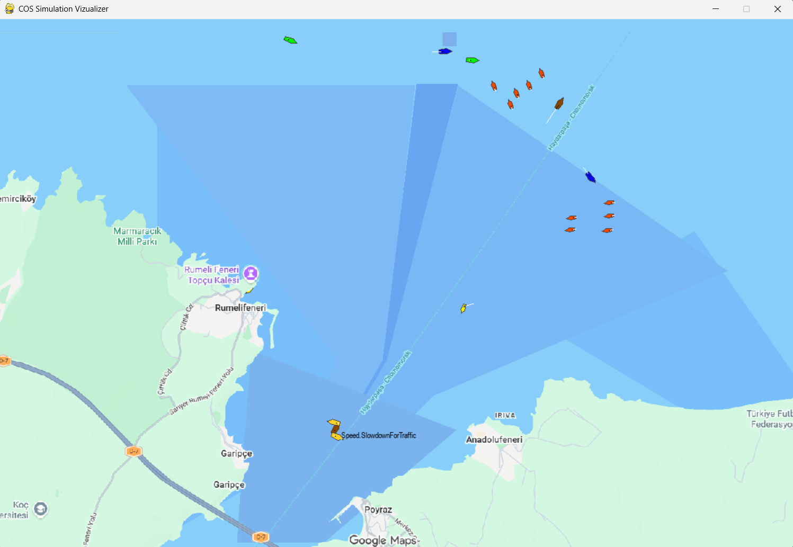

# Concepts: what COS is, and the problem it solves

[← INDEX](INDEX.md) · [walkthrough](walkthrough.md) · [glossary](glossary.md)

What COS is and is not, the problem every part of it answers, the hypotheses behind the design,
where it comes from, and where its view of the world ends. Read this page first; the others
assume it.

---

## What COS is, and what it isn't

COS is not a ship-handling simulator. It has no bridge, no helm and no three-dimensional sea, and
it is not where you train a navigator. Nor is it a collision-avoidance algorithm. It is a
**test ground**: a simulator whose job is to put an autonomous ship's software into many realistic
traffic situations and record, in a database, how well it kept to the rules of the sea.

The name says how it does this. It is an **operating system for simulations**. It has a kernel, a
boot sequence, a process scheduler, messaging between processes, device-like services and a
file store, the same parts a computer's operating system has. The things it schedules are not
programs but pieces of a simulated world: a coastline, a weather front, a ferry, an observer
that notices two ships crossing, a rule that judges them.

The comparison that matters most is with the traditional way of testing collision avoidance.
There, each test case is a short, hand-built encounter: two ships, open sea, a fixed geometry, and
a pass/fail check written into the test itself. COS keeps the knowledge out of the tests. Maps,
vessels, traffic, weather and the rules themselves are **data files**, and the situations that
need judging are **found while the simulation runs**, not scripted in advance. That is what lets
the same software be tested in a harbour, a strait and a fjord without writing new tests.

COS is made of five kinds of parts:

| Part | What it is | Where it lives |
|---|---|---|
| **The kernel** | Boots a simulation from a configuration file, schedules its services, carries messages between them | `src/cos/core` |
| **Faculties** | Plug-in services that make up the world and watch it: environment, actors, monitors, signals, rules | `src/cos`, `src/maritime`, `src/rules`, wired by `config/*.yaml` |
| **Legata** | A small language for writing rules, plus the machinery that checks them against the running simulation | `src/cos/lang/legata`, `config/maritime/regulation` |
| **Tools** | Programs to start, watch and query a simulation | `apps/coslaunch`, `apps/cviz`, `apps/costopic`, `apps/cosservice` |
| **The sweep pipeline** | Generates many variants of a scenario, runs them, and merges their results | `src/cos/cluster`, `src/cos/data/bi`, `templates/cluster` |

*Figure 1. The Istanbul scenario in cviz, the COS viewer. Land is green, water is shaded by depth,
and traffic lanes and zones are drawn as tinted overlays. Every vessel on screen is a service
inside one running COS process.*

---

## The central problem: rules speak of situations, simulators produce states

Every design decision in COS answers one problem. Name it now and the rest of the guide reads as
a list of answers.

**The rules of the sea are written about situations. A simulator only produces states.**

A simulator knows, at each step, where every vessel is, which way it points and how fast it moves.
That is its *state*. The International Regulations for Preventing Collisions at Sea (**COLREG**,
the "rules of the road" for ships) never mention positions. Rule 15 says: *when two power-driven
vessels are crossing so as to involve risk of collision, the vessel which has the other on her own
starboard side shall keep out of the way.* To check that rule, something has to decide that two
vessels are *crossing*, that there is *risk of collision*, and which one is on the other's
*starboard* (right-hand) side. None of those words is a number the simulator holds.

The rules are also vague on purpose. "Safe speed", "in ample time", "so far as practicable" are
judgements a human master makes from experience. The ER 2024 paper puts the gap plainly: the
rules are imprecise, abstract, cross-referencing and full of exceptions, and a machine can only
check precise facts.

COS closes the gap in stages. Each stage turns the output of the stage below into something a
little closer to the words of the rule:

| Stage | Takes | Produces | Done by |
|---|---|---|---|
| Physics | Forces, rudder, engine | Positions, headings, speeds (states) | Vessel behaviours, [the actors faculty](world.md#the-actors-faculty--the-vessels) |
| Situations | States of pairs of vessels | "Crossing", "head-on", "overtaking", "approach" (situations) | Monitors, [the monitors](regulation.md#the-monitors-faculty--situations) |
| Terms | A situation and a question | A value for a phrase like "distance to the traffic lane" | Resolvers, [the rules faculty](regulation.md#the-rules-faculty--legata-rules-and-examiners) |
| Rules | Terms | Kept or broken, clause by clause | Legata rules, [the rules faculty](regulation.md#the-rules-faculty--legata-rules-and-examiners) |
| Scores | Broken clauses | A penalty in a database row | Scorecards and examiners, [the rules faculty](regulation.md#the-rules-faculty--legata-rules-and-examiners) |

Read that table as the thesis of COS. The paper borrows the idea from Marvin Minsky's *Society of
Mind*: intelligence comes from many simple agents, each working at its own level of abstraction,
passing results upward. In COS those agents are called **faculties**. When you meet a design choice
that looks odd, such as a rule that never mentions a position, or an observer that does nothing but
label pairs of ships, check it against this table first. It is almost always a stage doing one job.

---

## Hypotheses, and what the design does not commit to

Four hypotheses carry the design, and each is visible in the code.

1. **An autonomous ship should be judged the way a human master is judged.** If machines and people
   share the sea, they should meet the same standard, tested over whole voyages in realistic
   traffic rather than in a handful of staged encounters. This is why COS runs long simulations of
   busy waters and scores everything that happens, instead of testing single manoeuvres.
2. **Small, specialised observers can compose into judgement.** No single piece of COS understands
   COLREG. A monitor labels a crossing; a resolver measures a distance; a rule checks a clause; a
   scorecard prices it. Each faculty is simple, and the chain is what reads the rule.
3. **Knowledge belongs in files, not in code.** Maps, fleets, weather, rule texts and penalties are
   data. Changing the test site, the traffic or the law means changing files, not rebuilding the
   simulator.
4. **Coverage comes from volume.** No finite set of hand-written tests covers every situation, so COS
   is built to run the same scenario many times with its conditions permuted, and to compare the
   results in one database ([sweeps](sweeps.md)).

What the design deliberately does **not** commit to matters as much:

- **No single domain.** The kernel knows nothing about ships. Everything maritime lives in
  `src/maritime` and the configuration. The paper names road, rail and air as future domains.
- **No single physics model.** The physics of a vessel is a plug-in behaviour. The one in use today is
  deliberately simple ([the actors faculty](world.md#the-actors-faculty--the-vessels)).
- **No single jurisdiction.** COLREG applies everywhere, but each site can add its own local rules,
  written in the same language ([the rules faculty](regulation.md#the-rules-faculty--legata-rules-and-examiners)).
- **No claim of completeness.** The paper's own lesson is *what you model is what you assure*. A rule
  that is not written, or a term that is not measured, is simply not tested.
- **No real-time guarantee.** A simulation step takes as long as the computer needs. Some timers use
  the wall clock, and that has consequences ([levels and timescales](synthesis.md#levels-and-timescales)).

---

## Lineage and neighbours

COS is not a clean-sheet design, and knowing what it borrows from lets you skip ahead.

**Simulation-based verification of autonomous ships** is the field it belongs to. The paper
positions COS against the *Open Simulation Platform* (OSP, an industry co-simulation standard for
ship models) and DNV's TestIT work. COS aims to host models like those as plug-ins, and adds
scenario sweeps and rule checking on top.

**Woerner's COLREG metrics** (MIT, 2016–2019) supply the encounter geometry. The thresholds in
`config/evaluator.yaml`, such as the 4,000 m, 1,100 m and 200 m ranges that stage an encounter and the
100 m minimum passing distance, follow that line of work.

**Minsky's *Society of Mind*** is the model for faculties: many small agents, each simple, whose
composition behaves intelligently ([the central problem](#the-central-problem-rules-speak-of-situations-simulators-produce-states)).

**Operating systems** supply the structure: a kernel, a boot sequence, run levels, a scheduler
calling services on a timer, a hierarchical namespace of named objects (like a file system), and
message queues between processes.

**ZeroMQ**, a messaging library, carries requests and events between a running simulation and the
tools that watch it ([talking to a running simulation](communication.md#talking-to-a-running-simulation)).

**High-performance computing (HPC) clusters** and their **workload managers** (the paper names
SLURM) run the sweep: one task per scenario, many at once ([sweeps](sweeps.md)).

**Data warehouses** supply the output format. Results are *facts* (things that happened, with a time
and a value) keyed by *dimensions* (where, which vessel, which scenario), the layout used for
analysis cubes, also called OLAP.

---

## What COS cannot see

A simulation only knows what it models. This section is about the edges of that knowledge, because
they decide what a result means. The paper's lesson applies literally: *what you model is what you
assure*.

**An unwritten rule is never broken.** COLREG has 41 rules, and COS loads a module for each. Rule 7 is marked
`enable: False`, but the boot loader does not read that flag, so it loads too
([scaffolding.md](scaffolding.md#disabled-manifest-entries-still-load)). But a rule is only checked when a monitor hands it a situation. Today only Rule 13
(overtaking) and the local rules do that, so a crossing is detected and recorded, yet Rule 15's
clause for crossings is never evaluated. In the running example no COLREG rule raised a violation.

**An unpriced clause costs nothing.** The Türkeli rule has a speed-limit clause, but the scorecard has
no price for it. When it fails, a `Generic` row with a penalty of 0 is written. The 405 zero rows in
[one run, end to end](walkthrough.md#one-run-end-to-end) are exactly this.

**An unmeasured term keeps its default.** Legata reads the world through resolvers
([the rules faculty](regulation.md#the-rules-faculty--legata-rules-and-examiners)). Some resolvers return fixed values
today: visibility is always 1.0, and wave height and wind speed seen by the risk network are always
0. A rule or network that depends on them sees clear, calm weather whatever the scenario says.

**Weather is generated more fully than it is used.** Each scenario's weather has wind, current and wave
fields, and regions of fog, rain and snow. Only the wave field changes a result today, through the
capsize check ([the rules faculty](regulation.md#the-rules-faculty--legata-rules-and-examiners)). Wind does not yet push
vessels, and nothing reads the fog regions.

**Identical input gives identical output.** Most sites in the repository started as copies of Türkeli,
and every site currently has the same 34 vessels. Where the data behind two scenario levels is the
same, their results will be the same.

**In our running example**, the fog is real data in the database, but *True North*'s penalty came from
its draft, not from the fog. The same run in clear weather would record the same violation.

None of this is hidden, and each gap is a place where a model, a resolver or a rule can be added.
Read a result together with this section, and ask of any number: *was the thing that produced it
actually modelled?*
