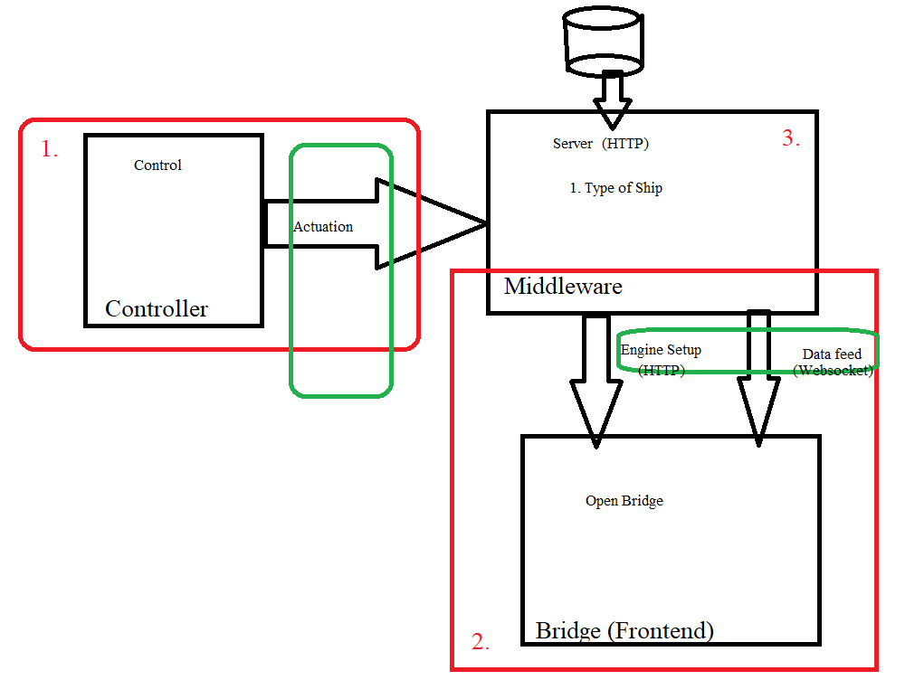

## Introduction
This is a simple example of a python service mediating vessel information to a client via websockets. The intent here is to 
demonstrate how the communication is expected to work with a simulation running on the cloud. 

The objective here is to allow a simulation to run as a middleware. The simulation exposes two ports:
-  Notification Service: A subscription mechanism for event notifications so client applications like a bridge software can update its display (in the demo it runs on port 8756).
-  API Service: An API service for interacting with the simulation using JSON RPC (in the demo it runs on port 8757).

The following diagram should clarify the concept and network achitecture. 

This is a contrived example to demonstrate the concepts with minimal dependencies. In this example the server is just a simple python websocket server, 
interacting with clientsusing JSON messages on the network. In a more realistic scenario, the simulation plays the role of the server. It exposes 
the same two services on the same similar port. But instead of the mock-up information, you interact with objects in the simulation. What objects 
you can interact with using the simulation API is easily found using the  *cosservice list* command. Similarly what objects publish 
notification, is easily found using the *costopic list* function.

In this contrieved example the websocket client receives notification about a vessel by connecting to a topic. For example, the following
information available to you:
- Host : localhost:8756
- Topic : /World/Vehicle/Vessel/POWER_DRIVEN/bedc897f-512b-45a2-aea4-bcfc248d2a87

Assume this is the infomation for a vessel, within the simulation running on localhost, that is identified by a globally 
unique identifier (bedc897f-512b-45a2-aea4-bcfc248d2a87). We can translate this to a websocket endpoint for notifiation
as follows. Connecting to this topic will provide frequent notification about the status of the vessel.

ws://localhost:8756/World/Vehicle/Vessel/POWER_DRIVEN/bedc897f-512b-45a2-aea4-bcfc248d2a87

Likewise a similar websocket endpoint services an API for the vessel. The difference is only in the port. API services are hosted on a different port 
on the server than the notification service. In the case of the demo, the port is 8757.

Running the following demo sample wit the instructions below should clarify the point. For simplicity, the server implemented in *server.py* 
does not use any modules of the simulation. We wanted to keep it simple with minimal dependencies to clarify the concepts.

## Setting up a sample
You will need python 3.x installed as a prerequisute. Once this is done, update the python package with the following command 
from this folder.

pip install requirements.txt

## Running the sample

### Starting the Server
Start the server with the following command. The sever starts a notification service on port 8756 and an API service on port 8757. 

*python server.py*

### Event Notifications
Websockets notifications are received here on the browser. Simply open up the bridge.html file. This is a plain HTML file that uses 
basic browser capabilities to receive websocket messages from the server on a wellknown port 8756 (in this example: localhost). 
You will see a ticking update of data on the browser including - angle, thrust etc.

### Running the Client
While runnign the server, and the a page on the browser receiving event notification, run the client with the following command. What 
this does is changes the startup seed on the ticker in the server - randomly. The result will be immediately seen on the browser where the
ticking values will change the range randomly to reflect the new seed.

*python client.py*

